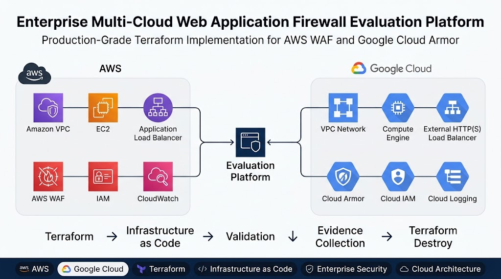

# Enterprise Multi-Cloud Web Application Firewall Evaluation Platform


## Hero Banner



## Project Overview

Placeholder: this section will summarize the AWS and Google Cloud implementation strategy for the same vulnerable web application, the WAF evaluation goals, and the security engineering scope.

## Project Objectives

Placeholder objectives:

- Document the same application pattern across AWS and Google Cloud
- Evaluate AWS WAF and Google Cloud Armor under comparable conditions
- Capture deployment, validation, attack simulation, failure injection, and cleanup evidence
- Build an implementation-ready repository with strong documentation from the start

## Architecture


- `architecture/`
- `diagrams/`

## Technology Stack

Placeholder stack summary:

- Terraform
- AWS
- Google Cloud
- AWS WAF
- Google Cloud Armor
- GitHub

## Repository Structure

```text
multicloud-waf-platform/
|-- aws/
|-- gcp/
|-- attack-scripts/
|-- architecture/
|-- diagrams/
|-- comparison/
|-- docs/
|-- evidence/
|-- assets/
`-- .github/
```

<details>
<summary>Expand structure notes</summary>

- `aws/` will hold AWS-specific Terraform layout and service grouping
- `gcp/` will hold Google Cloud-specific Terraform layout and service grouping
- `attack-scripts/` will hold future attack simulation tooling
- `architecture/` will hold high-level architecture assets
- `diagrams/` will hold design visuals and supporting diagrams
- `comparison/` will hold cross-cloud analysis artifacts
- `docs/` will hold phase-based project documentation
- `evidence/` will hold validation and milestone evidence
- `assets/` will hold branding and visual assets
- `.github/` will hold repository workflow and issue support assets

</details>

## Deployment Workflow

Placeholder: deployment workflow documentation will be added after Terraform implementation begins.

## Project Phases

Placeholder phases:

- Phase 0: Environment and repository setup
- Phase 1: AWS baseline implementation
- Phase 2: Google Cloud baseline implementation
- Phase 3: WAF and Cloud Armor validation
- Phase 4: Attack simulation
- Phase 5: Failure injection
- Phase 6: Comparison and analysis
- Phase 7: Cleanup and final evidence review

## AWS Services Used

Placeholder: AWS service inventory will be documented after implementation details are finalized.

## Google Cloud Services Used

Placeholder: Google Cloud service inventory will be documented after implementation details are finalized.

## Terraform Workflow

Placeholder: Terraform plan, apply, validate, destroy, and evidence flow will be documented here.

## Validation Evidence

Placeholder image references:


## Attack Simulation

Placeholder image reference:


## Failure Injection

Placeholder image reference:


## AWS vs GCP Comparison

Placeholder image reference:


## Cost Optimization

Placeholder: cost analysis findings will be summarized after implementation and teardown validation are completed.

## Terraform Destroy Validation

Placeholder image reference:


## Lessons Learned

Placeholder: implementation and validation lessons learned will be documented during later phases.

## Future Improvements

Placeholder future improvements:

- Expanded rule tuning scenarios
- Broader attack coverage
- Automated evidence collection
- CI/CD validation support

## References

Placeholder: provider documentation, WAF guidance, and comparison references will be added during implementation.

## License

MIT License
