<p align="center">
  
</p>

# Enterprise Multi-Cloud Security Engineering Project

> **Project Goal**
>
> Build and compare production-style AWS WAF and Google Cloud Armor environments using modular Terraform, enterprise documentation, validation evidence, and Infrastructure as Code best practices.

<p align="center">


</p>

## Enterprise Multi-Cloud Web Application Firewall Evaluation Platform

A production-style **Infrastructure as Code (IaC)** project demonstrating how to design, deploy, validate, and compare **AWS WAF** and **Google Cloud Armor** using reusable Terraform modules.

The project follows enterprise cloud engineering practices, emphasizing modular Terraform architecture, infrastructure validation, security best practices, evidence collection, and complete resource lifecycle management.

Rather than focusing on a single cloud provider, this repository demonstrates a **vendor-neutral implementation** that highlights equivalent cloud-native services across AWS and Google Cloud.

## Project Objectives

The primary objectives of this project are to:

- Build modular Terraform infrastructure
- Deploy secure AWS and GCP environments
- Implement AWS WAF and Google Cloud Armor
- Compare equivalent cloud-native services
- Validate infrastructure deployments
- Produce enterprise-grade documentation

## Key Features

### Infrastructure as Code

- Production-grade Terraform implementation
- Modular architecture
- Reusable modules
- Version-controlled infrastructure
- Environment-based configuration

### Multi-Cloud Deployment

- Amazon Web Services implementation
- Google Cloud Platform implementation
- Vendor-neutral architecture
- Cross-cloud service comparison

### Security

- AWS WAF
- Google Cloud Armor
- Identity and Access Management (IAM)
- Network security
- Layer 7 application protection
- Least Privilege Access

### Enterprise Documentation

- Architecture documentation
- Deployment guides
- Validation guides
- Cleanup guides
- Architecture comparison
- Terraform comparison
- Cost comparison

### Validation

- Terraform validation
- Infrastructure verification
- Browser testing
- Security validation
- Evidence collection
- Resource cleanup

## Project Overview

<p align="center">
  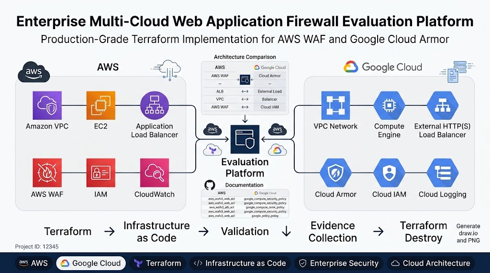
</p>

The project implements equivalent cloud architectures across AWS and Google Cloud while maintaining a consistent deployment workflow and Infrastructure as Code methodology.

Both implementations follow the same lifecycle:

```text
Terraform Init -> Terraform Format -> Terraform Validate -> Terraform Plan -> Terraform Apply -> Cloud Console Validation -> Evidence Collection -> Terraform Destroy
```

## Why This Project?

Enterprise organizations increasingly adopt **multi-cloud strategies** to improve resilience, reduce vendor lock-in, and leverage cloud-native services across providers.

This repository demonstrates how equivalent infrastructure can be implemented on AWS and Google Cloud while maintaining:

- Consistent architecture
- Consistent deployment methodology
- Consistent security controls
- Reusable Terraform modules
- Enterprise documentation standards
- Cost-conscious infrastructure lifecycle management

## Repository Highlights

| Category | Details |
|----------|---------|
| Cloud Providers | AWS & Google Cloud |
| Infrastructure as Code | Terraform |
| Compute | Amazon EC2 & Compute Engine |
| Load Balancing | ALB & External HTTP(S) Load Balancer |
| Web Protection | AWS WAF & Google Cloud Armor |
| Identity | AWS IAM & Cloud IAM |
| Documentation | 15+ Enterprise Documents |
| Evidence | Phase-wise Validation |
| Architecture | Multi-Cloud |
| Deployment | Modular Terraform |

## Table of Contents

- [Solution Architecture](#solution-architecture)
- [Technology Stack](#technology-stack)
- [Repository Structure](#repository-structure)
- [Infrastructure Lifecycle](#infrastructure-lifecycle)
- [Design Principles](#design-principles)
- [AWS Implementation](#aws-implementation)
- [Google Cloud Implementation](#google-cloud-implementation)
- [AWS vs Google Cloud Comparison](#aws-vs-google-cloud-comparison)
- [Documentation](#documentation)
- [Engineering Highlights](#engineering-highlights)
- [Validation Evidence](#validation-evidence)
- [Project Screenshots](#project-screenshots)
- [Implementation Roadmap](#implementation-roadmap)
- [Future Enhancements](#future-enhancements)
- [Learning Outcomes](#learning-outcomes)
- [License](#license)
- [Author](#author)

## Solution Architecture

<p align="center">
  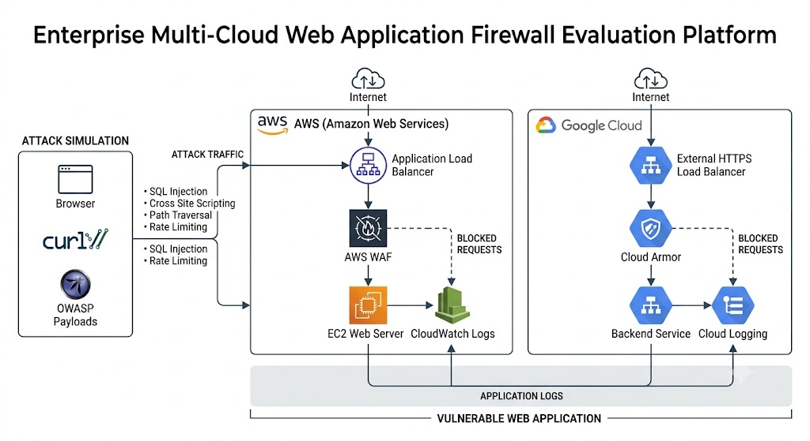
</p>

The project implements equivalent enterprise architectures across **Amazon Web Services (AWS)** and **Google Cloud Platform (GCP)** using Terraform.

Both environments follow the same Infrastructure as Code principles while leveraging cloud-native networking, compute, load balancing, web application firewall, identity management, and logging services.

## Technology Stack

<p align="center">
  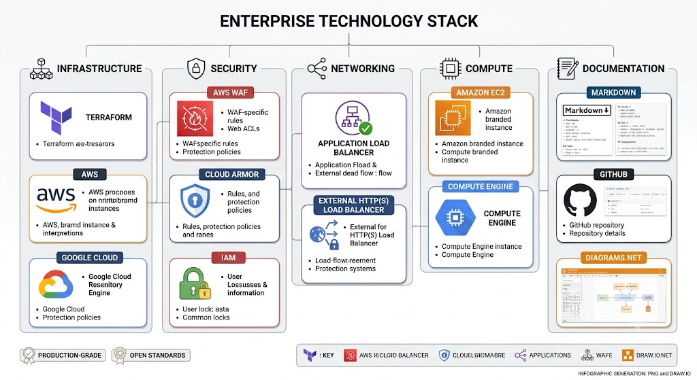
</p>

### Infrastructure as Code

| Technology | Purpose |
|------------|---------|
| Terraform | Infrastructure Provisioning |
| Git | Version Control |
| GitHub | Source Code Management |
| Markdown | Technical Documentation |

### Amazon Web Services

| Service | Purpose |
|---------|---------|
| Amazon VPC | Network Infrastructure |
| Amazon EC2 | Compute |
| Application Load Balancer | Layer 7 Load Balancing |
| AWS WAF | Web Application Firewall |
| AWS IAM | Identity and Access Management |
| Amazon CloudWatch | Logging and Monitoring |

### Google Cloud Platform

| Service | Purpose |
|---------|---------|
| VPC Network | Network Infrastructure |
| Compute Engine | Compute |
| External HTTP(S) Load Balancer | Layer 7 Load Balancing |
| Google Cloud Armor | Web Application Firewall |
| Cloud IAM | Identity and Access Management |
| Cloud Logging | Logging and Monitoring |

## Repository Structure

<p align="center">
  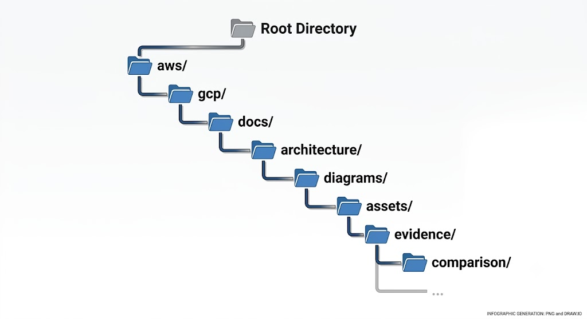
</p>

```text
Enterprise-MultiCloud-WAF-Platform/
│
├── aws/
│   ├── modules/
│   ├── main.tf
│   ├── variables.tf
│   ├── outputs.tf
│   └── terraform.tfvars
│
├── gcp/
│   ├── modules/
│   ├── main.tf
│   ├── variables.tf
│   ├── outputs.tf
│   └── terraform.tfvars
│
├── architecture/
│
├── assets/
│
├── diagrams/
│
├── docs/
│   ├── aws/
│   ├── gcp/
│   └── comparison/
│
├── evidence/
│   ├── aws/
│   └── gcp/
│
├── attack-scripts/
│
└── README.md
```

## Infrastructure Lifecycle

Both cloud implementations follow the same Infrastructure as Code lifecycle.

```text
terraform init

↓

terraform fmt

↓

terraform validate

↓

terraform plan

↓

terraform apply

↓

Cloud Console Validation

↓

Application Testing

↓

Evidence Collection

↓

terraform destroy
```

## Design Principles

The repository follows enterprise cloud engineering best practices.

- Modular Terraform Architecture
- Infrastructure as Code (IaC)
- Vendor-Neutral Design
- Principle of Least Privilege
- Layered Security
- Reusable Infrastructure Modules
- Complete Infrastructure Lifecycle
- Phase-wise Validation
- Comprehensive Documentation
- Cost-Conscious Resource Management

## AWS Implementation

The AWS environment demonstrates a production-style deployment of a secure web application protected by **AWS WAF** using modular Terraform.

### AWS Architecture

| Layer | AWS Service |
|--------|-------------|
| Network | Amazon VPC |
| Compute | Amazon EC2 |
| Load Balancer | Application Load Balancer |
| Web Application Firewall | AWS WAF |
| Identity | AWS IAM |
| Monitoring | Amazon CloudWatch |

### AWS Terraform Modules

| Module | Purpose |
|---------|---------|
| Network | VPC, Subnets, Internet Gateway, Route Tables |
| Security | Security Groups |
| Compute | EC2 Instance |
| ALB | Application Load Balancer |
| WAF | AWS WAF Web ACL |
| Logging | CloudWatch Integration |
| IAM | IAM Role and Instance Profile |

📖 Detailed documentation:

- [AWS Documentation](docs/aws/README.md)

## Google Cloud Implementation

The Google Cloud implementation provides the same enterprise architecture using cloud-native Google Cloud services.

### Google Cloud Architecture

| Layer | Google Cloud Service |
|--------|----------------------|
| Network | VPC Network |
| Compute | Compute Engine |
| Load Balancer | External HTTP(S) Load Balancer |
| Web Application Firewall | Google Cloud Armor |
| Identity | Cloud IAM |
| Monitoring | Cloud Logging |

### Google Cloud Terraform Modules

| Module | Purpose |
|---------|---------|
| Network | VPC Network and Subnet |
| Firewall | Firewall Rules |
| Compute | Compute Engine |
| Load Balancer | External HTTP(S) Load Balancer |
| Cloud Armor | Security Policy |
| Logging | Cloud Logging |
| IAM | Service Account and IAM Bindings |

📖 Detailed documentation:

- [Google Cloud Documentation](docs/gcp/README.md)

## AWS vs Google Cloud Comparison

One of the primary objectives of this repository is to demonstrate equivalent infrastructure implementations across two major cloud providers.

| Infrastructure Layer | AWS | Google Cloud |
|----------------------|-----|--------------|
| Network | Amazon VPC | VPC Network |
| Compute | Amazon EC2 | Compute Engine |
| Load Balancer | Application Load Balancer | External HTTP(S) Load Balancer |
| Web Application Firewall | AWS WAF | Google Cloud Armor |
| Identity | AWS IAM | Cloud IAM |
| Logging | Amazon CloudWatch | Cloud Logging |
| Infrastructure as Code | Terraform | Terraform |

### Comparison Documentation

| Document | Description |
|----------|-------------|
| Architecture Comparison | docs/comparison/architecture-comparison.md |
| WAF Comparison | docs/comparison/waf-comparison.md |
| Terraform Comparison | docs/comparison/terraform-comparison.md |
| Cost Comparison | docs/comparison/cost-comparison.md |

## Documentation

The repository includes comprehensive technical documentation for every implementation phase.

| Documentation | Description | Link |
|---------------|-------------|------|
| AWS Implementation | Architecture, Deployment, Validation, Cleanup | docs/aws/README.md |
| Google Cloud Implementation | Architecture, Deployment, Validation, Cleanup | docs/gcp/README.md |
| Multi-Cloud Comparison | Architecture, WAF, Terraform, Cost | docs/comparison/README.md |
| Architecture Diagrams | Enterprise Architecture |
| Deployment Guides | Step-by-Step Instructions |
| Validation Guides | Infrastructure Verification |
| Cleanup Guides | Resource Removal |


### Documentation Structure

```text
docs/
│
├── aws/
│   ├── README.md
│   ├── architecture.md
│   ├── deployment-guide.md
│   ├── validation.md
│   └── cleanup.md
│
├── gcp/
│   ├── README.md
│   ├── architecture.md
│   ├── deployment-guide.md
│   ├── validation.md
│   └── cleanup.md
│
└── comparison/
    ├── README.md
    ├── architecture-comparison.md
    ├── waf-comparison.md
    ├── terraform-comparison.md
    └── cost-comparison.md
```

## Engineering Highlights

This project demonstrates practical experience with:

- Enterprise Infrastructure as Code (IaC)
- AWS Cloud Security
- Google Cloud Security
- AWS WAF
- Google Cloud Armor
- Modular Terraform Development
- Multi-Cloud Architecture
- Infrastructure Validation
- Technical Documentation
- Cost-Optimized Resource Lifecycle

## Validation Evidence

Infrastructure validation was performed after every deployment phase to ensure that all resources were provisioned successfully and functioned as expected.

Evidence includes:

- Terraform Validation
- Terraform Plan
- Successful Infrastructure Deployment
- Cloud Console Verification
- Browser Validation
- Security Validation
- Resource Cleanup
- Terraform Destroy

### Evidence Structure

```text
evidence/
├── aws/
│   ├── phase-01/
│   ├── phase-02/
│   ├── phase-03/
│   ├── phase-04/
│   ├── phase-05/
│   ├── phase-06/
│   ├── phase-07/
│   └── phase-08/
│
└── gcp/
    ├── phase-01/
    ├── phase-02/
    ├── phase-03/
    ├── phase-04/
    ├── phase-05/
    ├── phase-06/
    └── phase-07/
```

## Repository Metrics

| Metric | Count |
|---------|------:|
| Cloud Providers | 2 |
| Terraform Root Modules | 2 |
| Terraform Child Modules | 14 |
| Documentation Files | 15 |
| Architecture Diagrams | 12+ |
| Visual Assets | 5 |
| Validation Phases | 15 |
| Terraform Lifecycle | End-to-End |
| Repository Version | v1.0.0 |

## Project Screenshots

The following screenshots demonstrate the successful deployment and validation of the AWS and Google Cloud implementations.

| AWS Deployment | Google Cloud Deployment |
|----------------|-------------------------|
| 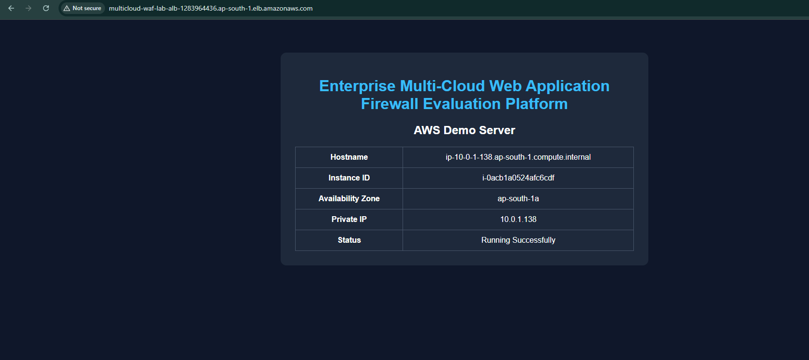 | 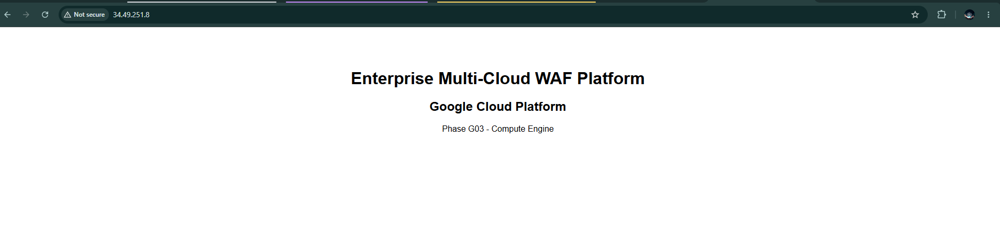 |

**Figure 1:** AWS application successfully deployed and validated through the Application Load Balancer after AWS WAF protection.

**Figure 2:** Google Cloud application successfully deployed and validated through the External HTTP(S) Load Balancer protected by Google Cloud Armor.

| AWS WAF | Google Cloud Armor |
|----------|--------------------|
| 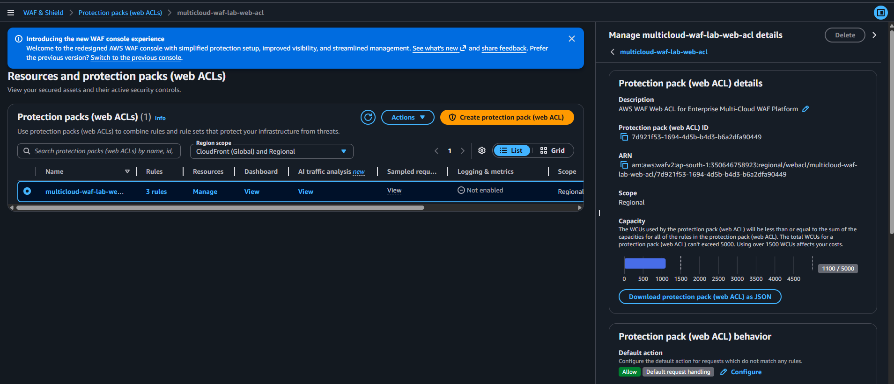 | 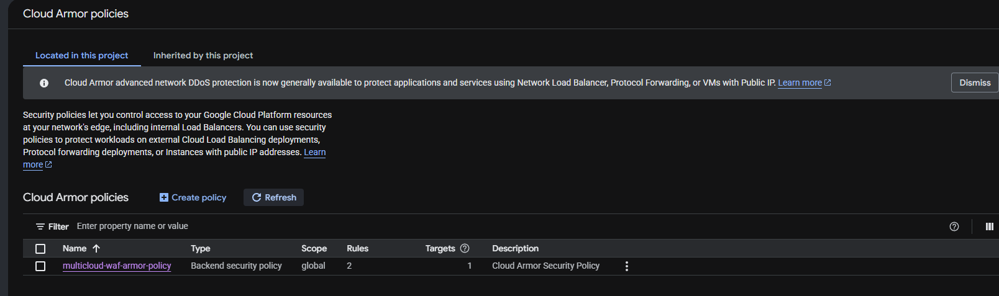 |

**Figure 3:** AWS WAF Web ACL configuration with managed security rules.

**Figure 4:** Google Cloud Armor security policy protecting the backend service.

| AWS IAM | Google Cloud Cleanup |
|----------|----------------------|
| 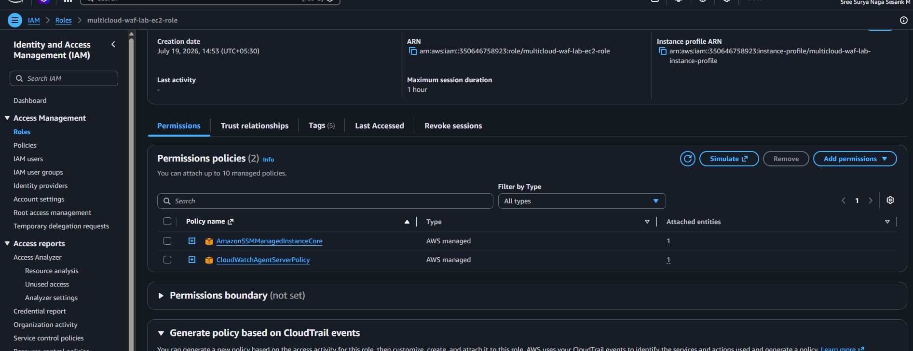 | 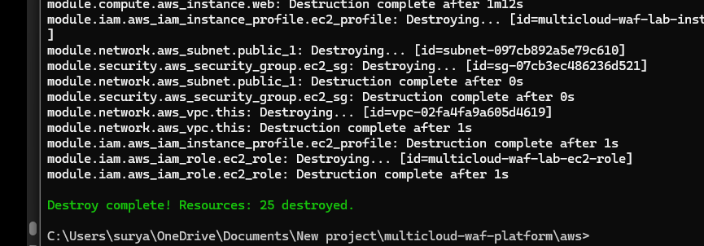 |

**Figure 5:** AWS IAM Role attached to the EC2 instance following the Principle of Least Privilege.

**Figure 6:** Google Cloud infrastructure successfully removed using `terraform destroy`, completing the Infrastructure as Code lifecycle.

## Implementation Roadmap

<p align="center">
  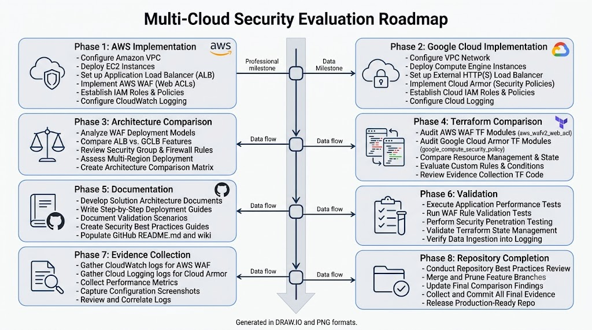
</p>

### Completed

- Environment Planning
- Terraform Repository Design
- AWS Infrastructure
- Google Cloud Infrastructure
- AWS WAF Implementation
- Google Cloud Armor Implementation
- Infrastructure Validation
- Enterprise Documentation
- Multi-Cloud Comparison
- Evidence Collection

### Future Enhancements

Planned improvements include:

- Azure Web Application Firewall
- Azure Application Gateway
- Multi-Region Deployment
- GitHub Actions CI/CD
- Terraform Cloud Integration
- Security Policy Automation
- OWASP Top 10 Test Automation
- Infrastructure Compliance Validation
- Monitoring Dashboards
- Cost Optimization Dashboard
- GitHub Actions Terraform Validation
- Pre-commit Hooks

## Learning Outcomes

- Multi-Cloud Architecture
- Terraform Module Design
- AWS WAF
- Google Cloud Armor
- IAM
- Infrastructure Validation
- Enterprise Documentation
- Infrastructure Lifecycle Management

## License

This project is licensed under the MIT License.

See the `LICENSE` file for additional information.

### Author

**Surya**

Cloud Security Engineer | AWS | GCP | Terraform | DevSecOps

[](https://github.com/nagasesank)
[](https://www.linkedin.com/in/suryasesank/)


## Acknowledgements

This project was developed as a hands-on engineering portfolio to demonstrate enterprise Infrastructure as Code practices, cloud security implementation, and multi-cloud architecture using AWS and Google Cloud.

<p align="center">

Built with ❤️ using Terraform, AWS, Google Cloud and Enterprise Cloud Security Practices.

</p>
