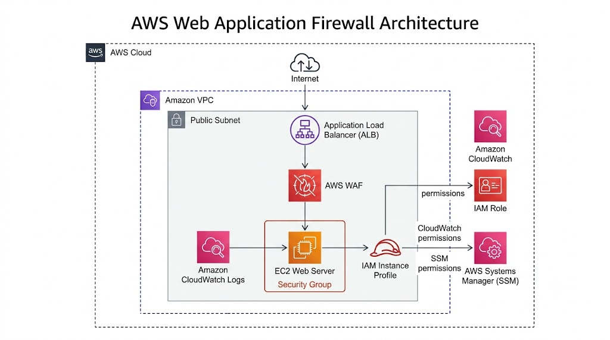
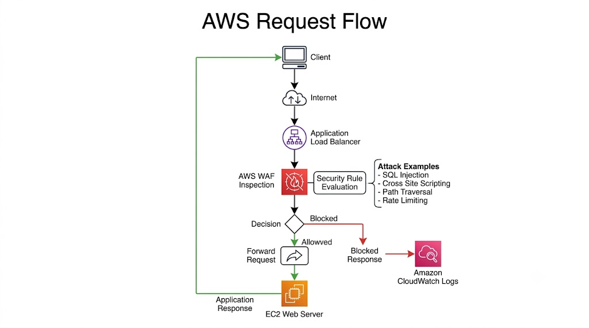
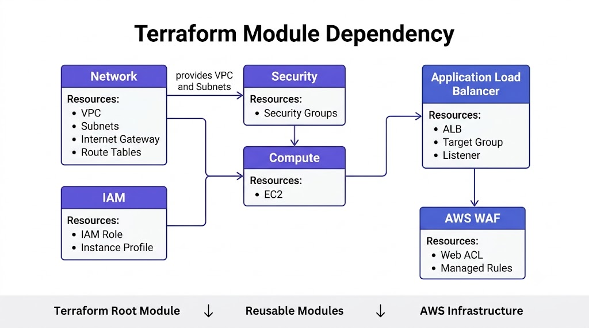

# AWS Architecture

## Overview

The AWS implementation of the **Enterprise Multi-Cloud Web Application Firewall Evaluation Platform** follows a modular, secure, and production-oriented architecture. Each infrastructure component is provisioned using Terraform and organized into reusable modules.

The architecture is designed with the following principles:

- Modular Infrastructure as Code (IaC)
- Enterprise-grade security
- High availability
- Layered network protection
- Least Privilege IAM
- Reusable Terraform modules
- Infrastructure lifecycle management


# High-Level Architecture


*Figure 1: High-Level AWS Architecture*

## Architecture Components

### Amazon VPC

The Virtual Private Cloud (VPC) provides network isolation for all deployed AWS resources.

Responsibilities:

- Private network boundary
- IP address management
- Subnet segmentation
- Secure communication


### Public Subnet

The public subnet hosts internet-facing infrastructure components.

Resources deployed:

- EC2 Web Server
- Application Load Balancer

### Internet Gateway

Provides internet connectivity between AWS resources and external clients.


### Security Groups

Security Groups provide stateful firewall protection.

Configured rules include:

- HTTP (80)
- HTTPS (443)
- SSH (22) (restricted to administrator IP)

### EC2 Instance

The EC2 instance hosts the sample web application.

Security features:

- IAM Role authentication
- Security Group protection
- Managed through Terraform

### Application Load Balancer

The Application Load Balancer distributes incoming Layer 7 traffic to backend EC2 instances.

Features:

- HTTP listener
- Health checks
- Backend routing


### AWS WAF

AWS WAF provides Layer 7 protection against common web attacks.

Implemented capabilities:

- Managed Rule Groups
- SQL Injection protection
- Cross-site scripting protection
- OWASP Top 10 mitigation


### IAM

The IAM module provides secure authentication for the EC2 instance.

Resources:

- IAM Role
- IAM Instance Profile
- CloudWatch permissions
- Amazon SSM permissions


# Request Flow


*Figure 2: AWS Request Flow*

Traffic flow:

```
Client

↓

Internet

↓

AWS WAF

↓

Application Load Balancer

↓

EC2 Instance

↓

Application Response
```


# Terraform Module Architecture


*Figure 3: Terraform Module Dependency*

Module relationship:

```
Network
   │
   ├──────────────┐
   │              │
Security        IAM
   │              │
   └──────┐       │
          ▼       ▼
        Compute
           │
           ▼
          ALB
           │
           ▼
          WAF
```

# Security Architecture

The implementation follows a layered security model.

## Network Layer

- Amazon VPC
- Security Groups
- Internet Gateway

## Compute Layer

- EC2
- IAM Role
- Instance Profile

## Application Layer

- Application Load Balancer
- AWS WAF

## Management Layer

- AWS Systems Manager
- Amazon CloudWatch


# Design Principles

The architecture follows these engineering principles:

- Modular Terraform design
- Least Privilege access
- No hardcoded credentials
- Infrastructure as Code
- Reusable components
- Separation of concerns
- Production-ready deployment


# Architecture Summary

| Layer | AWS Service |
|--------|-------------|
| Network | Amazon VPC |
| Security | Security Groups |
| Compute | Amazon EC2 |
| Load Balancing | Application Load Balancer |
| Web Protection | AWS WAF |
| Identity | AWS IAM |
| Monitoring | Amazon CloudWatch |
| Management | AWS Systems Manager |


# Related Documentation

- README.md
- deployment-guide.md
- validation.md
- cleanup.md