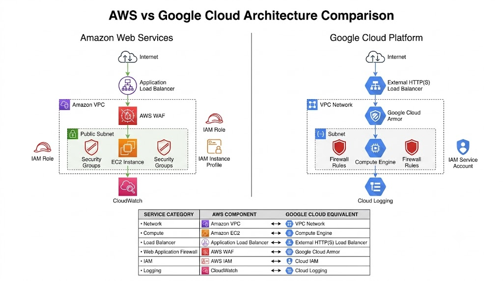
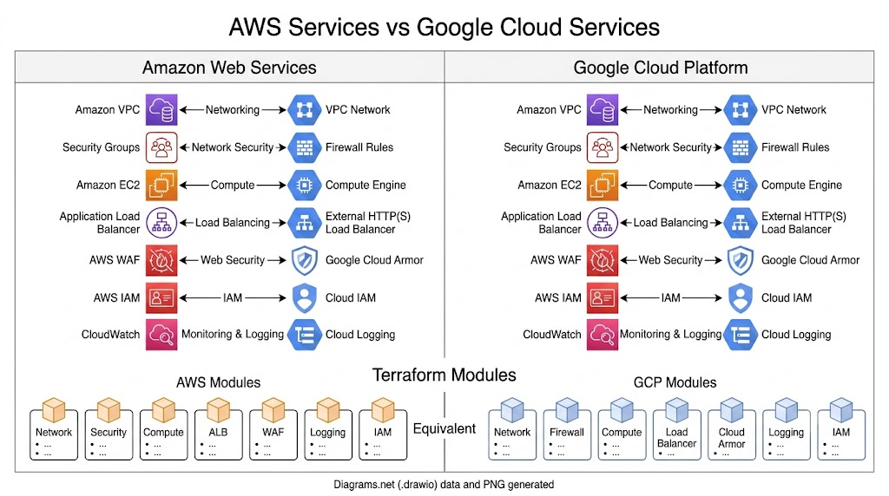
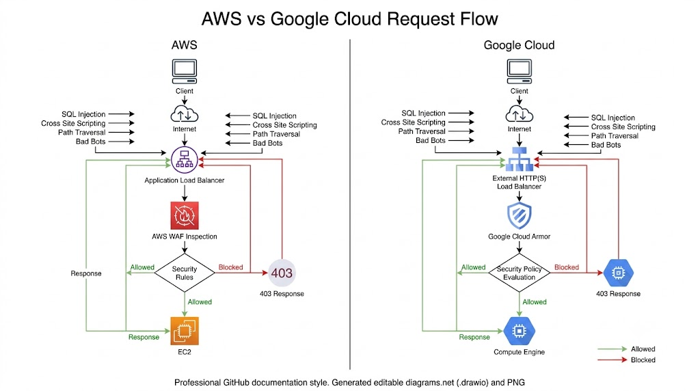

# AWS vs Google Cloud Architecture Comparison

## Overview

This document compares the AWS and Google Cloud implementations of the **Enterprise Multi-Cloud Web Application Firewall Evaluation Platform**.

Although both cloud providers offer different services and terminology, the overall architecture follows the same enterprise design principles, security model, and Infrastructure as Code (IaC) methodology.

## High-Level Architecture Comparison



*Figure 1: High-Level Architecture Comparison*

## Architecture Principles

Both implementations follow the same engineering principles:

- Infrastructure as Code
- Modular Terraform Design
- Layered Security
- Least Privilege Access
- Enterprise Networking
- Web Application Firewall Protection
- Centralized Logging
- Complete Infrastructure Lifecycle

## Service Mapping



*Figure 2: Equivalent Cloud Services*

## Architecture Comparison

| Layer | AWS | Google Cloud |
|--------|-----|--------------|
| Network | Amazon VPC | VPC Network |
| Subnet | Public Subnet | Subnet |
| Firewall | Security Groups | Firewall Rules |
| Compute | Amazon EC2 | Compute Engine |
| Load Balancer | Application Load Balancer | External HTTP(S) Load Balancer |
| WAF | AWS WAF | Google Cloud Armor |
| Identity | AWS IAM | Cloud IAM |
| Logging | CloudWatch | Cloud Logging |

## Request Flow Comparison



*Figure 3: Request Flow Comparison*

### AWS Request Flow

```text
Client
    │
    ▼
Internet
    │
    ▼
Application Load Balancer
    │
    ▼
AWS WAF
    │
    ▼
EC2 Instance
    │
    ▼
Application Response
```

### Google Cloud Request Flow

```text
Client
    │
    ▼
Internet
    │
    ▼
External HTTP(S) Load Balancer
    │
    ▼
Google Cloud Armor
    │
    ▼
Compute Engine
    │
    ▼
Application Response
```

## Security Comparison

| Security Layer | AWS | Google Cloud |
|----------------|-----|--------------|
| Network Security | Security Groups | Firewall Rules |
| Web Protection | AWS WAF | Google Cloud Armor |
| Identity | IAM Roles | Service Accounts |
| Logging | CloudWatch | Cloud Logging |

## Terraform Design Comparison

Both cloud implementations follow the same Terraform design philosophy:

- Reusable Modules
- Separate Variables and Outputs
- Environment-based Configuration
- Infrastructure Validation
- Modular Resource Organization
- Complete Resource Cleanup

## Summary

Although AWS and Google Cloud use different services, both implementations provide equivalent enterprise capabilities for networking, web application protection, identity management, logging, and Infrastructure as Code.

## Related Documentation

- README.md
- waf-comparison.md
- terraform-comparison.md
- cost-comparison.md