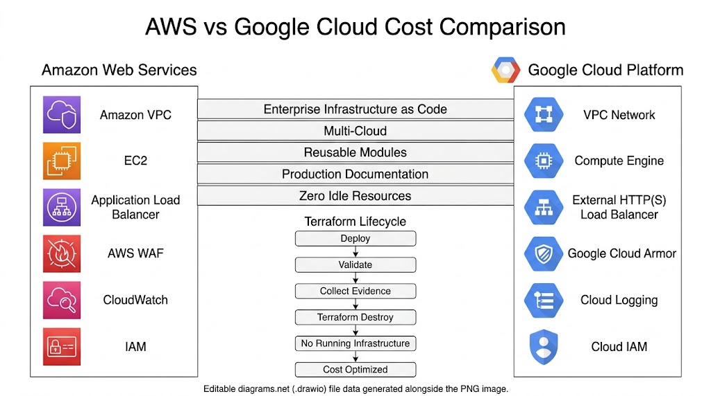

# AWS vs Google Cloud Cost Comparison

## Overview

This document compares the cost considerations for the AWS and Google Cloud implementations of the **Enterprise Multi-Cloud Web Application Firewall Evaluation Platform**.

The project was designed with a strong emphasis on cost optimization. Resources are deployed only for validation, evidence collection, and testing, then removed immediately using Terraform.

## Cost Optimization Strategy



*Figure 1: Cost Optimization Strategy Across AWS and Google Cloud*

The same deployment lifecycle is followed for both cloud providers:

```text
Deploy

↓

Validate

↓

Collect Evidence

↓

Terraform Destroy

↓

No Running Resources
```

## Cost Management Principles

The project follows these principles:

- Deploy infrastructure only when required
- Validate resources immediately after deployment
- Capture evidence during the validation phase
- Destroy infrastructure after testing
- Avoid long-running resources
- Prevent unnecessary cloud charges
- Use Infrastructure as Code for repeatable deployments

## Resource Comparison

| Infrastructure | AWS | Google Cloud |
|----------------|-----|--------------|
| Network | Amazon VPC | VPC Network |
| Compute | Amazon EC2 | Compute Engine |
| Load Balancer | Application Load Balancer | External HTTP(S) Load Balancer |
| Web Protection | AWS WAF | Google Cloud Armor |
| Logging | CloudWatch | Cloud Logging |
| Identity | IAM | Cloud IAM |

## Deployment Lifecycle

| Phase | Activity | Cost Consideration |
|------|----------|--------------------|
| Deploy | `terraform apply` | Resources are created only when needed |
| Validate | Functional verification | Keep validation duration short |
| Evidence | Capture screenshots | Complete immediately after validation |
| Cleanup | `terraform destroy` | Remove all billable resources |

## Terraform Cost Control

Both implementations use the same Infrastructure as Code workflow.

```text
terraform init

↓

terraform fmt

↓

terraform validate

↓

terraform plan

↓

terraform apply

↓

Validation

↓

Evidence Collection

↓

terraform destroy
```

This workflow ensures that infrastructure exists only for the duration required to complete testing and documentation.

## Best Practices

The following practices help minimize cloud costs:

- Deploy only the required resources
- Destroy resources after validation
- Verify that Terraform state is clean
- Confirm resource removal in the cloud console
- Avoid idle compute instances
- Avoid unused load balancers
- Keep deployment time as short as practical
- Store evidence locally after validation

## Cleanup Verification

After `terraform destroy`, verify:

| Validation | AWS | Google Cloud |
|------------|-----|--------------|
| Compute Removed | ✅ | ✅ |
| Network Removed | ✅ | ✅ |
| Load Balancer Removed | ✅ | ✅ |
| WAF Removed | ✅ | ✅ |
| IAM Resources Removed | ✅ | ✅ |
| Terraform State Empty | ✅ | ✅ |

## Key Takeaways

Both cloud implementations follow the same cost management strategy.

- Infrastructure is provisioned only for testing.
- Evidence is collected immediately after deployment.
- Terraform removes all managed resources after validation.
- No long-running infrastructure is retained.
- The workflow supports efficient, repeatable, and cost-conscious Infrastructure as Code practices.

## Related Documentation

- README.md
- architecture-comparison.md
- waf-comparison.md
- terraform-comparison.md