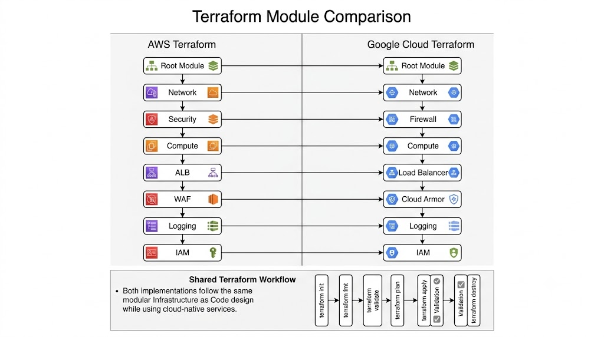

# Terraform Implementation Comparison

## Overview

This document compares the Terraform implementation used for the AWS and Google Cloud environments in the **Enterprise Multi-Cloud Web Application Firewall Evaluation Platform**.

Both implementations follow the same Infrastructure as Code (IaC) methodology, repository structure, and deployment workflow. The primary differences are the cloud-native resources and Terraform providers.

## Terraform Module Comparison



*Figure 1: AWS and Google Cloud Terraform Module Comparison*

## Repository Structure

```text
project-root/
├── aws/
│   ├── modules/
│   ├── main.tf
│   ├── variables.tf
│   ├── outputs.tf
│   └── terraform.tfvars
│
├── gcp/
│   ├── modules/
│   ├── main.tf
│   ├── variables.tf
│   ├── outputs.tf
│   └── terraform.tfvars
│
└── docs/
```

## Terraform Provider Comparison

| Component | AWS | Google Cloud |
|-----------|-----|--------------|
| Provider | hashicorp/aws | hashicorp/google |
| Authentication | AWS CLI Profile | gcloud CLI |
| Region | AWS Region | GCP Region |
| Project Configuration | AWS Account | GCP Project |

## Module Comparison

| AWS Module | GCP Module | Purpose |
|------------|------------|---------|
| network | network | Network Infrastructure |
| security | firewall | Network Security |
| compute | compute | Virtual Machine |
| alb | load-balancer | Layer 7 Load Balancer |
| waf | cloud-armor | Web Application Firewall |
| logging | logging | Centralized Logging |
| iam | iam | Identity and Access Management |

## Infrastructure Lifecycle

Both implementations use the same Terraform lifecycle.

```text
terraform init

↓

terraform fmt

↓

terraform validate

↓

terraform plan

↓

terraform apply

↓

Cloud Console Validation

↓

Evidence Collection

↓

terraform destroy
```

## Configuration Files

| File | Purpose |
|------|---------|
| main.tf | Module orchestration |
| variables.tf | Input variables |
| outputs.tf | Export values |
| terraform.tfvars | Environment-specific values |
| versions.tf | Terraform and provider versions |

## Module Design Principles

Both implementations follow the same design principles:

- Modular Architecture
- Reusable Components
- Separation of Concerns
- Environment-based Configuration
- Infrastructure as Code
- Version-controlled Infrastructure

## Validation Workflow

The validation process is identical for both cloud providers.

| Step | AWS | Google Cloud |
|------|-----|--------------|
| Terraform Format | ✅ | ✅ |
| Terraform Validate | ✅ | ✅ |
| Terraform Plan | ✅ | ✅ |
| Terraform Apply | ✅ | ✅ |
| Console Validation | ✅ | ✅ |
| Evidence Collection | ✅ | ✅ |
| Terraform Destroy | ✅ | ✅ |

## Resource Mapping

| Infrastructure Layer | AWS Resource | Google Cloud Resource |
|----------------------|--------------|-----------------------|
| Network | Amazon VPC | VPC Network |
| Security | Security Groups | Firewall Rules |
| Compute | EC2 Instance | Compute Engine |
| Load Balancer | Application Load Balancer | External HTTP(S) Load Balancer |
| WAF | AWS WAF | Google Cloud Armor |
| Identity | IAM Role | Service Account |
| Logging | CloudWatch | Cloud Logging |

## Key Differences

| AWS | Google Cloud |
|------|--------------|
| Uses `hashicorp/aws` provider | Uses `hashicorp/google` provider |
| IAM Roles and Instance Profiles | Service Accounts and IAM Bindings |
| Security Groups | Firewall Rules |
| Application Load Balancer | External HTTP(S) Load Balancer |
| AWS WAF | Google Cloud Armor |

## Summary

The Terraform implementations are intentionally designed to be consistent across both cloud providers. While the cloud services and providers differ, the repository layout, module organization, deployment workflow, validation process, and Infrastructure as Code principles remain the same.

## Related Documentation

- README.md
- architecture-comparison.md
- waf-comparison.md
- cost-comparison.md