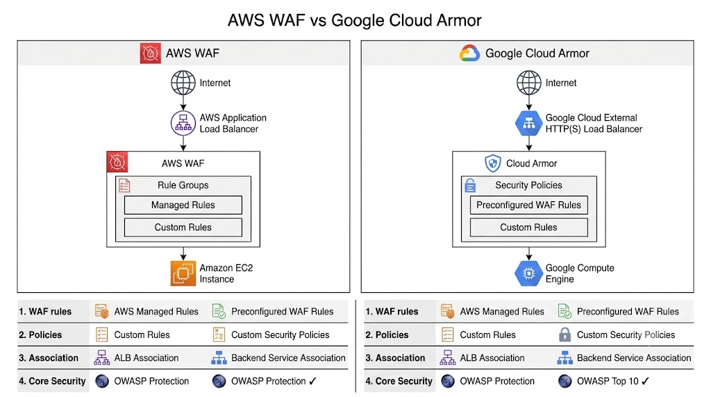
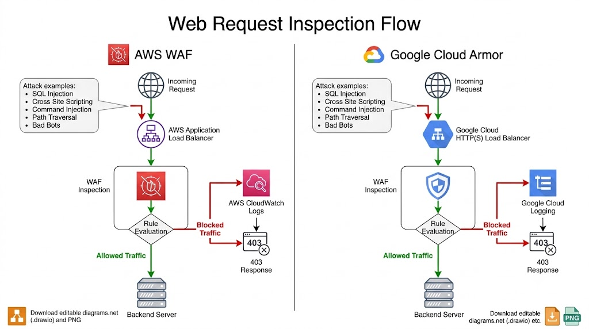
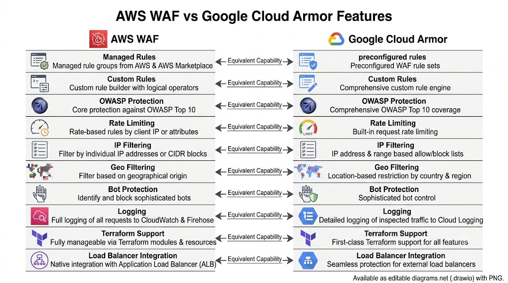

# AWS WAF vs Google Cloud Armor Comparison

## Overview

This document compares the Web Application Firewall (WAF) services used in the **Enterprise Multi-Cloud Web Application Firewall Evaluation Platform**.

AWS WAF and Google Cloud Armor both provide Layer 7 application protection against common web attacks. Although their implementations differ, both services offer enterprise-grade capabilities for securing internet-facing applications.

## Architecture Comparison

*Figure 1: AWS WAF and Google Cloud Armor Architecture*

## Request Inspection Flow

*Figure 2: Request Inspection Workflow*

## Feature Comparison

*Figure 3: Feature Comparison*

## Service Comparison

| Capability | AWS WAF | Google Cloud Armor |
|------------|----------|--------------------|
| Service Type | Web Application Firewall | Web Application Firewall |
| Integration | Application Load Balancer | External HTTP(S) Load Balancer |
| Managed Rules | AWS Managed Rule Groups | Preconfigured WAF Rules |
| Custom Rules | Supported | Supported |
| OWASP Protection | Supported | Supported |
| SQL Injection Protection | Supported | Supported |
| Cross Site Scripting Protection | Supported | Supported |
| IP Filtering | Supported | Supported |
| Rate Limiting | Supported | Supported |
| Logging | CloudWatch | Cloud Logging |
| Terraform Support | Supported | Supported |

## Rule Management

### AWS WAF

- AWS Managed Rule Groups
- Custom Rules
- IP Sets
- Rule Priorities
- Web ACL Association

### Google Cloud Armor

- Security Policies
- Preconfigured WAF Rules
- Custom Rules
- IP-based Rules
- Backend Service Association

## Attack Protection

Both services protect against:

- SQL Injection (SQLi)
- Cross Site Scripting (XSS)
- Path Traversal
- Command Injection
- Malicious Bots
- HTTP Protocol Violations
- Layer 7 Application Attacks

## Logging Comparison

| AWS | Google Cloud |
|------|--------------|
| Amazon CloudWatch | Cloud Logging |
| WAF Logs | Security Policy Logs |
| Request Monitoring | Request Monitoring |

## Terraform Integration

Both implementations use dedicated Terraform modules.

| AWS | Google Cloud |
|------|--------------|
| modules/waf | modules/cloud-armor |

Both modules:

- Create security policies
- Associate policies with the load balancer
- Support Infrastructure as Code
- Enable repeatable deployments

## Summary

AWS WAF and Google Cloud Armor provide comparable enterprise-grade web application security capabilities.

While terminology and service integration differ, both solutions support:

- Layer 7 Protection
- Managed Security Rules
- Custom Security Policies
- OWASP Protection
- Infrastructure as Code
- Production Deployments

## Related Documentation

- architecture-comparison.md
- terraform-comparison.md
- cost-comparison.md