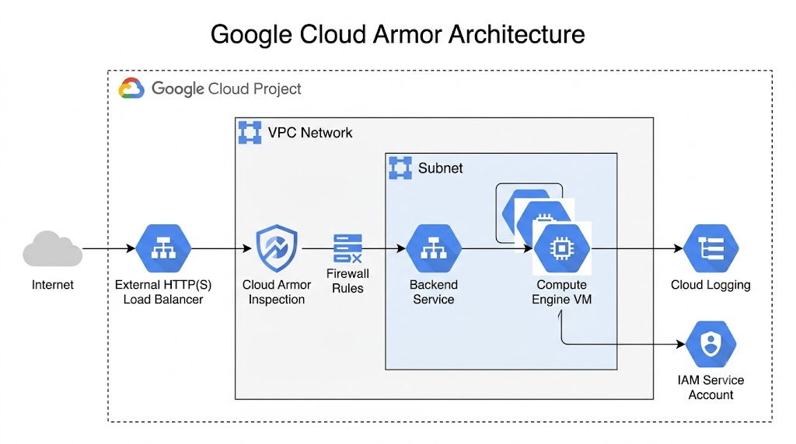
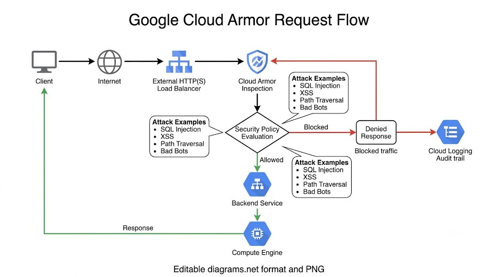
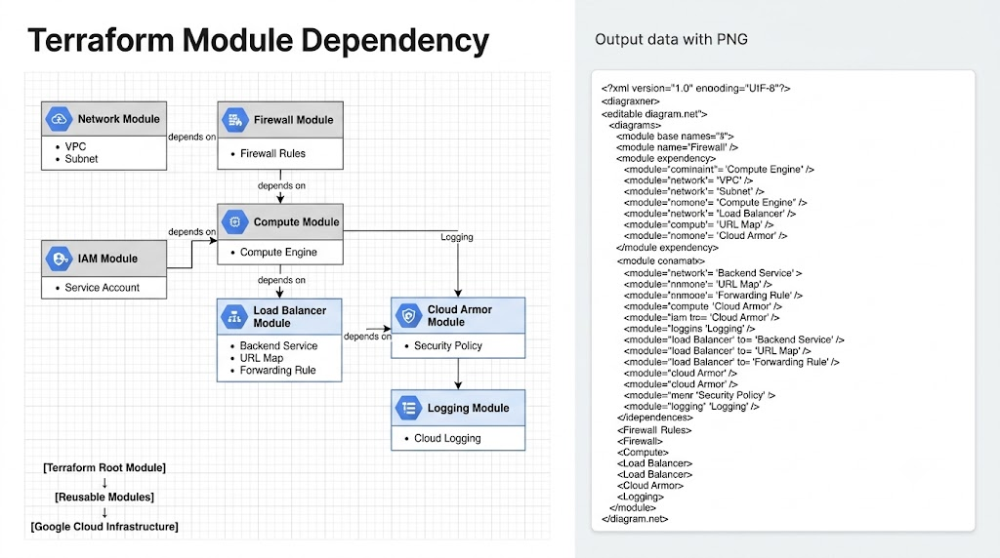

# Google Cloud Architecture

## Overview

The Google Cloud implementation of the **Enterprise Multi-Cloud Web Application Firewall Evaluation Platform** follows a modular, scalable, and enterprise-oriented architecture.

All infrastructure components are provisioned using Terraform and organized into reusable modules. The architecture demonstrates how Google Cloud Armor protects internet-facing applications while maintaining secure networking, identity management, and centralized logging.

The architecture follows these design principles:

- Modular Infrastructure as Code
- Enterprise Security
- Layered Network Protection
- Principle of Least Privilege
- Reusable Terraform Modules
- Infrastructure Lifecycle Management

## High-Level Architecture



*Figure 1: High-Level Google Cloud Architecture*

## Architecture Components

### Google Cloud Project

Provides logical isolation for all deployed resources.

Responsibilities:

- Resource management
- IAM management
- Billing
- Service enablement

## VPC Network

The Virtual Private Cloud provides network isolation for deployed resources.

Responsibilities:

- Network segmentation
- Internal communication
- Secure resource deployment

## Subnet

The subnet hosts the Compute Engine virtual machine.

Responsibilities:

- IP allocation
- Resource connectivity
- Network isolation

## Firewall Rules

Firewall rules control inbound and outbound traffic.

Configured rules include:

- HTTP (80)
- HTTPS (443)
- SSH (22) (Administrator Access)

## Compute Engine

The Compute Engine virtual machine hosts the sample web application.

Features:

- Startup Script
- Firewall Integration
- IAM Service Account
- Managed by Terraform

## External HTTP(S) Load Balancer

Provides Layer 7 load balancing for internet traffic.

Features:

- Frontend IP
- Backend Service
- URL Map
- Health Check
- Forwarding Rule

## Google Cloud Armor

Cloud Armor protects the application from common Layer 7 attacks.

Implemented capabilities:

- Security Policies
- OWASP Protection
- SQL Injection Protection
- Cross Site Scripting Protection
- IP-based Filtering

## Cloud Logging

Collects logs generated by Google Cloud resources.

Features:

- Centralized logging
- Request monitoring
- Security event visibility

## Cloud IAM

Cloud IAM provides secure identity and access management.

Implemented resources:

- Service Account
- IAM Bindings

## Request Flow



*Figure 2: Request Flow through Google Cloud Armor*

Traffic Flow

```text
Client

↓

Internet

↓

External HTTP(S) Load Balancer

↓

Google Cloud Armor

↓

Backend Service

↓

Compute Engine VM

↓

Application Response
```

## Terraform Module Dependency



*Figure 3: Terraform Module Dependency*

Module Relationship

```text
Network
    │
    ▼
Firewall
    │
    ▼
Compute
    │
    ▼
Load Balancer
    │
    ▼
Cloud Armor
    │
    ▼
Logging

IAM
 │
 └────────► Compute
```

## Security Architecture

The implementation follows a layered security approach.

### Network Layer

- VPC Network
- Firewall Rules

### Compute Layer

- Compute Engine
- IAM Service Account

### Application Layer

- External HTTP(S) Load Balancer
- Google Cloud Armor

### Monitoring Layer

- Cloud Logging

## Design Principles

The architecture follows enterprise cloud engineering best practices.

- Infrastructure as Code
- Modular Terraform Design
- Reusable Components
- Principle of Least Privilege
- Layered Security
- Centralized Logging
- Separation of Concerns
- Production-ready Deployment

## Architecture Summary

| Layer | Google Cloud Service |
|--------|----------------------|
| Project | Google Cloud Project |
| Network | VPC Network |
| Security | Firewall Rules |
| Compute | Compute Engine |
| Load Balancing | External HTTP(S) Load Balancer |
| Web Protection | Google Cloud Armor |
| Identity | Cloud IAM |
| Monitoring | Cloud Logging |

## Related Documentation

- README.md
- deployment-guide.md
- validation.md
- cleanup.md